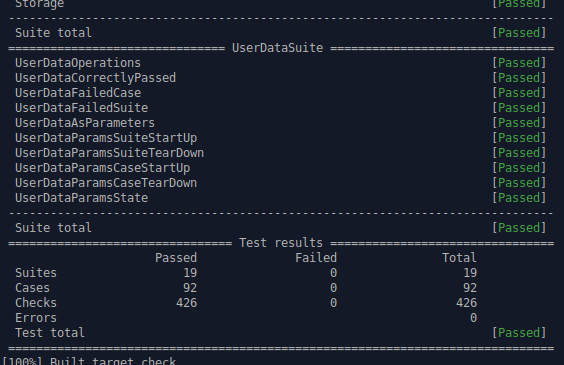

# OTest2

**Project site:** [https://staon.github.io/otest2/](https://staon.github.io/otest2/)

**Current CI status:** 

**Current version:** [1.3.0](https://github.com/Staon/otest2/releases/tag/v1.3.0)

**Downloads:** [https://github.com/Staon/otest2/releases/](https://github.com/Staon/otest2/releases/)

**OTest2** is a small C++ framework designated for writing of any kind of
automated tests (unit tests, integration tests, etc.). Its design is derived
from an older project of mine written while I was working for
[Aveco](http://www.aveco.com/) - that's why there is 2 in the name. As far as
I know the original project is still in use.

## Project's design goals

1. getting rid of writing boiler plate code,
2. extensibility of the framework for different development environments,
3. DSL compatible with IDE functions like syntax highlighting and code assist.

## Features

* An [xUnit](https://en.wikipedia.org/wiki/XUnit) kind framework.
* No need to write boiler plate code - it's done by a generator.
* DSL is a valid C++ code which doesn't break fancy IDE functions like code
  assistance.
* Very cautious usage of C macros.
* Test cases are grouped in suites.
* Tags can be assigned to both test suites and test cases. There is
  a tag glob language allowing filtering of testing objects from test execution.
* A rich set of assertion functions. Beside the generic assertion there
  are relational assertions, assertions comparing content of STL containers
  or text files. The framework allows implementation of custom assertion functions.
* Test fixtures are supported both in the suites or the test cases. The fixtures
  may be initialized and destroyed by their constructor and destructor methods
  (as it's common in C++) or they can be initialized in special start-up
  and tear-down methods.  
* Test sections allow to share the same initialization code with several
  testing sections. 
* User can implement own fixture objects with hook methods invoked during
  start-up and tear-down phase of suite or test case where the object is used.
* Possible integration with custom main event loop. The framework doesn't
  control run of the tests but it offers an API which can be invoked from
  the main loop. A default implementation of the loop is available too.
* User data may be passed from the main function into the testing functions.
  User can inject some context into tests.
* Regression test marks - a structured representation of complex data like
  logical state of an object or some complex output of something. The marks
  can be stored and then checked in following runs of the test.
* Exception handling. The framework offers special try/catch directive which
  allows to check whether an expected exception occurs. Unexpected exceptions
  unwound from testing objects are caught, reported and the test is failed.
* A custom exception catcher can be injected into the framework to handle your
  exception objects. 
* One can implement a repeater object which controls repeated run of testing
  objects. The repeater is not just a list of values but a dynamic object
  with possible access to fixture objects. 
* Optional report in the JUnit XML file format.
* Nice color console report.

  

 

See the project site [https://staon.github.io/otest2/](https://staon.github.io/otest2/)
for detailed documentation, examples and the install guide.
